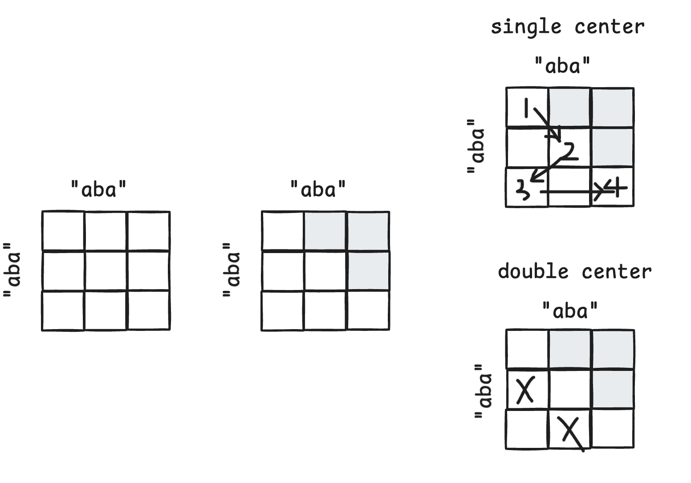

思路是这样的，回文串目前看到的都是两类中心各自扩展。

这里的想法是，从最naive的解法开始，两级循环，想象一个二维表格。然后很显然字符串的性质是切片两个index顺序不影响切片本身，这里可以想像一个因果mask。到这一步不改变O(n^2)

这里回文最关键的性质是回文串左右收缩一个格也是回文，这样可以消复杂度。这里想象在二维格子可以向左下斜对角走，可以skip一些东西，复杂度

阶段	格子数	每格成本	总时间	空间
朴素两级循环 + 逐个校验回文	n²	O(n)	O(n³)	O(1)
加因果 mask(s[i:j] 与顺序无关,只留 i≤j)	n(n+1)/2	O(n)	O(n³),只省一半常数	O(1)
用「收缩封闭」查左下邻居	n(n+1)/2	O(1)	O(n²)	O(n²)
中心扩展(沿对角线链走,不存表)	只走到链断	O(1)	Θ(n + 答案),最坏 Θ(n²)	O(1)
Manacher(链与链之间再共享信息)	—	摊还 O(1)	O(n)	O(n)